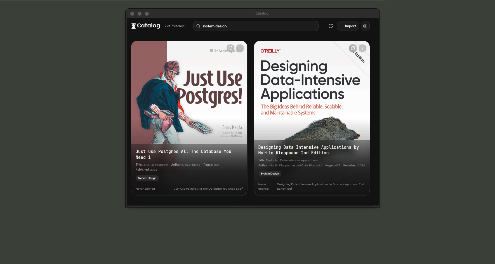
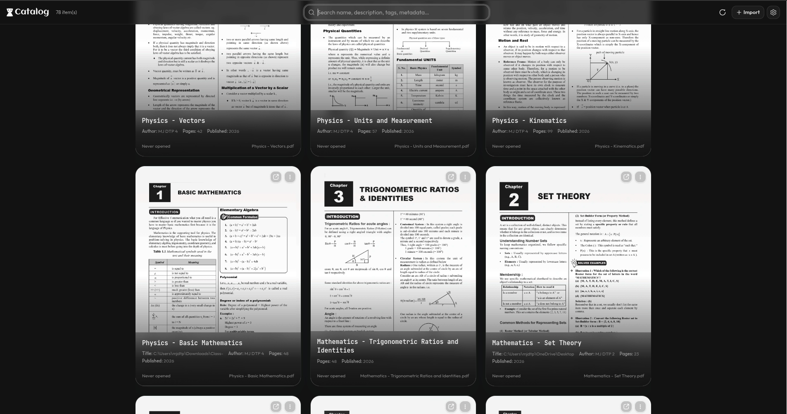

# Catalog

A personal book library manager for PDFs scattered all over your system — in different directories, buried in nested folders, across drives.


One solution: point Catalog at a folder (or a whole drive), it walks every nested directory, catalogs each PDF, renders its cover, and gives you one-click access to open any book from a single searchable grid.




No more remembering paths or hunting through dozens of folders: **import once, search, click, read.**

## Supported Platforms & Downloads

| Platform | Package | Install |
|----------|---------|---------|
| Windows | `catalog-<version>-setup.exe` | Double-click the installer |
| Arch Linux | `catalog-<version>.pacman` | `sudo pacman -U catalog-<version>.pacman` |
| Debian / Ubuntu | `catalog_<version>_amd64.deb` | `sudo dpkg -i catalog_<version>_amd64.deb` |
| Linux (portable) | `catalog-<version>.tar.gz` | Extract, then run `catalog` from the folder |
| Linux (universal) | `catalog-<version>.AppImage` | `chmod +x catalog-<version>.AppImage && ./catalog-<version>.AppImage` |

> **For the latest release and downloads, check the [latest release notes](https://github.com/arihantdotcom/catalog/releases/latest).**

## Features

- **Bulk import** — scan an entire folder tree (recursively) and catalog every PDF it finds. Existing files are skipped automatically.
- **One-click open** — every book opens in your default PDF viewer with a single click. No need to remember where a file lives.
- **Cover thumbnails** — the first page of each PDF is rendered into a cover image automatically. Rendering runs in a background pipeline (4 files at a time) with a progress bar, so large 300+ page PDFs no longer block the app; failed covers retry automatically on refresh.
- **Search** — fuzzy full-text search across names, descriptions, tags, and PDF metadata (title, author, keywords, page count…).
- **Rich metadata** — title, author, subject, keywords, page count, and dates are extracted from each PDF and stored with the item.
- **Missing file detection** — if a book is moved or renamed, the card flags it and offers **Repoint** (auto-find the new location) or **Locate…** (pick the file manually).
- **Selection & bulk delete** — select multiple items (hover a card to reveal the checkbox) and delete them from the catalog in one go. The PDF files themselves are never deleted.
- **Dark / Light / System themes** — switchable from the settings drawer, plus a one-click **Clear all** to wipe the catalog.



## Tech Stack

- [Electron](https://www.electronjs.org/) + [electron-vite](https://electron-vite.org/)
- [React](https://react.dev/) 19 + [TypeScript](https://www.typescriptlang.org/)
- [Tailwind CSS](https://tailwindcss.com/) 4 + [shadcn/ui](https://ui.shadcn.com/) (Base UI / vaul)
- [pdf.js](https://mozilla.github.io/pdf.js/) for thumbnail rendering and metadata extraction
- [Fuse.js](https://www.fusejs.io/) for fuzzy search
- [SQLite](https://www.sqlite.org/) (Node's built-in `node:sqlite`) for the catalog database

## Project Setup

### Install

```bash
npm install
```

### Development

```bash
npm run dev
```

### Build

```bash
# For Windows
npm run build:win

# For macOS
npm run build:mac

# For Linux
npm run build:linux

# Unpacked build (no installer)
npm run build:unpack
```

## Scripts

| Command              | Description                              |
| -------------------- | ---------------------------------------- |
| `npm run dev`        | Start the app in development mode (HMR)  |
| `npm run start`      | Preview a production build               |
| `npm run typecheck`  | Type-check main, preload, and renderer   |
| `npm run lint`       | Lint the codebase                        |
| `npm run format`     | Format all files with Prettier           |
| `npm run build`      | Type-check and bundle the app            |
| `npm run build:*`    | Package installers for each platform     |

## How It Works

1. **Import** — `Import ▸ File` adds a single PDF; `Import ▸ Bulk` scans a whole directory tree. Items are written to the SQLite database instantly, so the grid fills immediately.
2. **Covers** — a concurrency-limited background pipeline reads each file, renders the first page to a WebP thumbnail, and extracts metadata — then updates the card in place.
3. **Open** — clicking a card opens the book in your default application and records "last opened".
4. **Repair** — on every launch (and refresh), the app checks that files and thumbnails still exist; anything missing is flagged and covers are regenerated.

## Project Structure

```
src/
├── main/          Electron main process (window, SQLite, file I/O, IPC)
├── preload/       Context-bridged IPC API exposed as window.api
├── renderer/
│   └── src/
│       ├── components/  UI components (item card, dialogs, settings drawer)
│       ├── lib/         cover pipeline, PDF info, search, thumbnail utils
│       └── App.tsx      Main application
└── shared/         Shared TypeScript types
```

## Recommended IDE Setup

- [VSCode](https://code.visualstudio.com/) + [ESLint](https://marketplace.visualstudio.com/items?itemName=dbaeumer.vscode-eslint) + [Prettier](https://marketplace.visualstudio.com/items?itemName=esbenp.prettier-vscode)